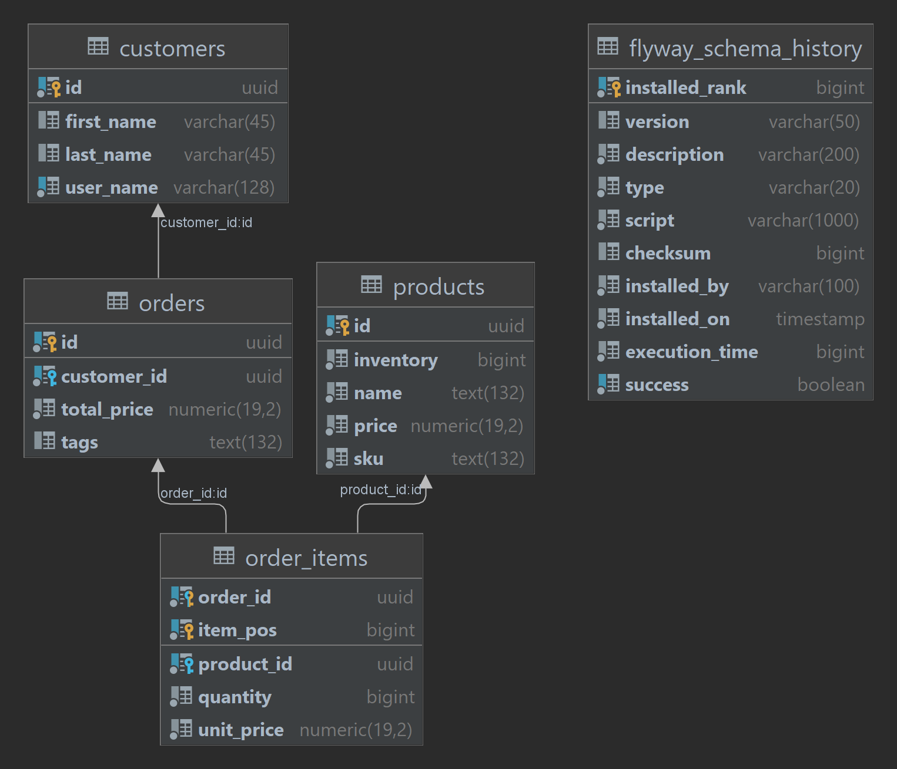

# CockroachDB Spring Boot :: Multi Tenancy Demo

A standalone spring boot app demonstrating Spring's Routing Datasource 
to seamlessly use multiple data source for multi-tenancy. 

It models a dead-simple order system using[Spring Data JPA](https://spring.io/projects/spring-data-jpa) 
and Hibernate.

Key takeaways:

- Routing datasource to switch between read-only and read-write data sources
- Transaction propagation attributes following entity-control-boundary
- Flyway to migrate multi-tenant schemas

## Relevant Articles:

- [Spring Annotations for CockroachDB](https://blog.cloudneutral.se/spring-annotations-for-cockroachdb)

## ER model

## Using

### Prerequisites

- JDK8+ with 1.8 language level (OpenJDK compatible)
- Maven 3+ (wrapper provided)
- CockroachDB with 3 databases named `roach_spring_boot_alpha`,`roach_spring_boot_bravo` and `roach_spring_boot_caesar`

### Building

    ./mvnw clean install
    
### Running the tests

    mvn -DskipTests=false test
    
